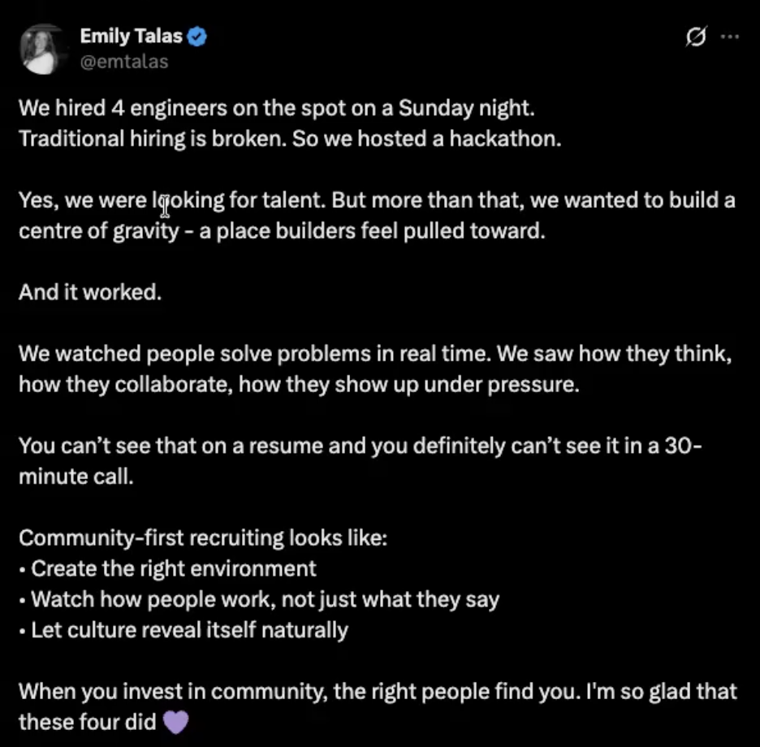

# Stanley for X Chrome Extension

Chrome extension that turns LinkedIn-style drafts inside Stanley into posts that feel native to X.

[Successor: Xpo](https://shernanjavier.com/work/xpo)

## The idea

A good post on LinkedIn does not necessarily feel like a good post on X.

The platforms have different formatting, tone, length, and culture, so simply copying the same draft across both tends to feel out of place.

Stanley for X was a small experiment around adding an **X mode directly inside Stanley** — keeping the original idea while rewriting and previewing it for a different platform.

## What it does

- Watches drafts directly inside Stanley thread pages
- Generates an X-native version alongside the original draft
- Supports shorter, longer, and custom rewrite instructions
- Handles standard and verified X character limits
- Keeps revision history between rewrites
- Lets users edit generated posts directly
- Supports image attachments and an X-style preview
- Opens X compose with the final post already filled in

## How it works

```text
Stanley draft
     ↓
Chrome extension
     ↓
Capture current content
     ↓
Rewrite request
     ↓
X-native draft
     ↓
Edit + revise
     ↓
Preview
     ↓
Open X compose
````

## Technical highlights

* Injected a custom X workflow into an existing third-party web application
* Observed changing draft state inside Stanley rather than requiring users to copy content into another tool
* Built an AI-assisted revision loop with shorter, longer, and custom rewrite controls
* Maintained per-thread revision state so users could move between generated versions
* Added platform-aware character limits for standard and verified X accounts
* Built image attachment and X-style preview flows directly into the extension UI
* Handed posts off to X compose without automatically publishing on the user's behalf

## Stack

`Chrome Extension` · `TypeScript` · `Groq` · `Browser APIs`

## X mode

The main interaction is a LinkedIn / X mode switch embedded directly into Stanley.

When X mode is active, the extension adds a lightweight workflow for adapting the current draft.

### Rewriting

Users can:

* make a post shorter
* make it longer
* give a custom rewrite instruction
* optionally force lowercase output
* move backward and forward through revisions
* manually edit the generated result

### Platform limits

The extension supports both X account modes:

```text
Standard account
280 characters

Verified account
25,000 characters
```

Changing modes updates both the visible character limit and the rewrite behavior.

### Preview and publishing

Users can attach up to four images and preview the final post in an X-style interface before publishing.

When ready, the extension opens:

```text
https://x.com/compose/post
```

and fills the compose box with the generated text.

It intentionally does **not** automatically publish the post.

## Architecture

```text
Stanley
   ↓
content script
   ↓
draft state
   ↓
extension UI
   ↓
rewrite request
   ↓
backend
   ↓
Groq
   ↓
generated revision
   ↓
local revision state
   ↓
preview / X compose
```

The extension sits on top of Stanley rather than replacing it.

Stanley remains the source of the original draft while the extension manages the X-specific interface, rewriting workflow, revisions, preview, and final handoff.

## Project origin

I saw a post from Emily about Stan's build-in-public hiring experiments and how they had hired engineers through previous hackathons.

<p align="center">
  
</p>

One reply stood out to me: they liked the hiring strategy, but said they almost skipped the post because it looked too much like a LinkedIn post.

<p align="center">
  
</p>

That was the idea.

Instead of building another standalone writing tool, I wanted to see what it would look like if the platform adaptation happened **inside Stanley**, where the draft already existed.

So I built an X mode directly into the product.

This was the original Stanley for X experiment.

It is separate from the later `0 → 1000` challenge project that eventually grew into **Xpo**.

<details>
<summary><strong>Run locally</strong></summary>

Install dependencies:

```bash
pnpm install
```

Create a `.env` file:

```text
GROQ_API_KEY=your_groq_key_here
```

Optional configuration:

```text
GROQ_MODEL=llama-3.3-70b-versatile
PORT=8787
```

Start the backend:

```bash
pnpm backend:dev
```

In another terminal, start the extension:

```bash
pnpm dev
```

Then open:

```text
chrome://extensions
```

Enable developer mode, select **Load unpacked**, and choose:

```text
.output/chrome-mv3-dev
```

Open Stanley and start or generate a draft.

</details>

<details>
<summary><strong>Implementation notes</strong></summary>

### Draft workflow

The extension keeps the original Stanley draft as the starting point and maintains separate X-specific revision state.

```text
original draft
      ↓
initial X rewrite
      ↓
revision 1
      ↓
revision 2
      ↓
manual edit
      ↓
final post
```

Users can move between revisions instead of losing previous generations.

### Why integrate directly into Stanley?

The goal was to reduce context switching.

Instead of:

```text
Stanley
   ↓
copy
   ↓
another AI tool
   ↓
rewrite
   ↓
copy
   ↓
X
```

the experiment becomes:

```text
Stanley
   ↓
X mode
   ↓
rewrite
   ↓
X
```

### Tradeoffs

* The extension does not understand the user's full X history or account context
* Translating formatting alone is not enough to guarantee good X content
* LinkedIn and X differ culturally as well as structurally
* Rewrite quality depends heavily on the context available in the original draft
* The project was intentionally scoped as a proof of concept rather than a complete creator intelligence system

These limitations were part of what motivated the larger Xpo project.

### Mock mode

If `GROQ_API_KEY` is not configured, the application can still run using its mock behavior.

</details>
